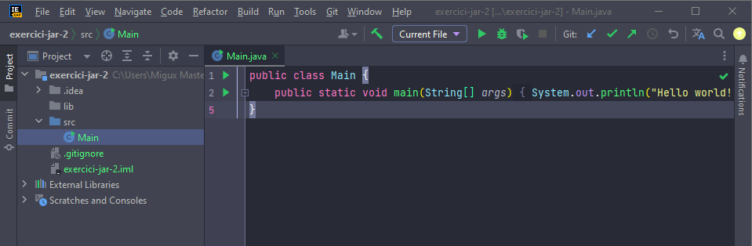
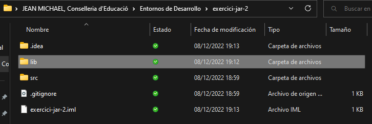
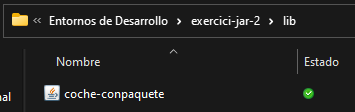
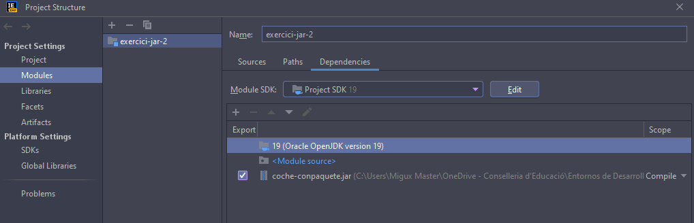
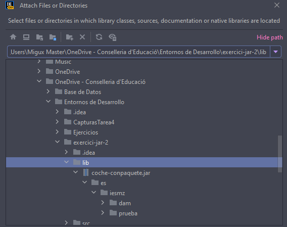
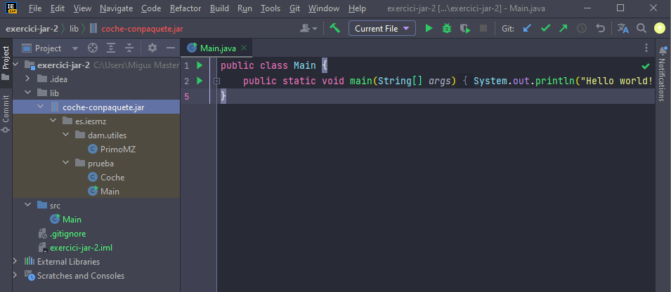
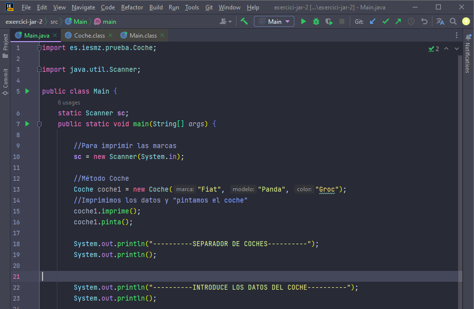
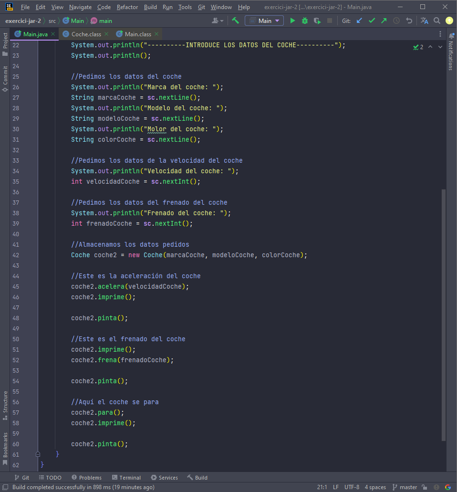

## UD3-T4-IntelliJ-JAR-2 -- JeanMichaelGranizoVera

```
1. **Primer paso**
    Deberemos crear un nuevo proyecto. En este caso lo tendremos que nombrar "exercici-jar-2".
```

```
Una vez creada deberemos crear una nueva carpeta, en este caso llamado "lib". Y dentro de ella deberemos copiar y pegar el .jar.
```


```
Una vez creado esto debemos estructurar el .jar para que se vea el sdk del paquete importado.
```



```
Y listo, ya lo tendríamos todo para funcionar y proyectar nuestro main.
```

---

```
2. **Segundo paso**
    En este paso sólo voy a proyectar el código main, he comentado el código dejando claro que lo he entendido y definiendo bien las variables.
```

---



